# 🏢 Active Directory Home Lab (Windows Server + GPO)

## 📌 Overview
This project simulates a real-world enterprise Active Directory environment.

I built a domain, joined client machines, created users/groups, and enforced security policies using Group Policy Objects (GPO).

---

## 🧰 Technologies Used
- Windows Server (Domain Controller)
- Active Directory Domain Services (AD DS)
- DNS
- Windows 11 Client VM
- Group Policy Management (GPO)
- Hyper-V

---

## 🏗️ Lab Architecture
- 1 Domain Controller (DC01)
- 1 Windows 11 Client
- Domain: `corp.local`
- Organizational Unit: `Employees`
  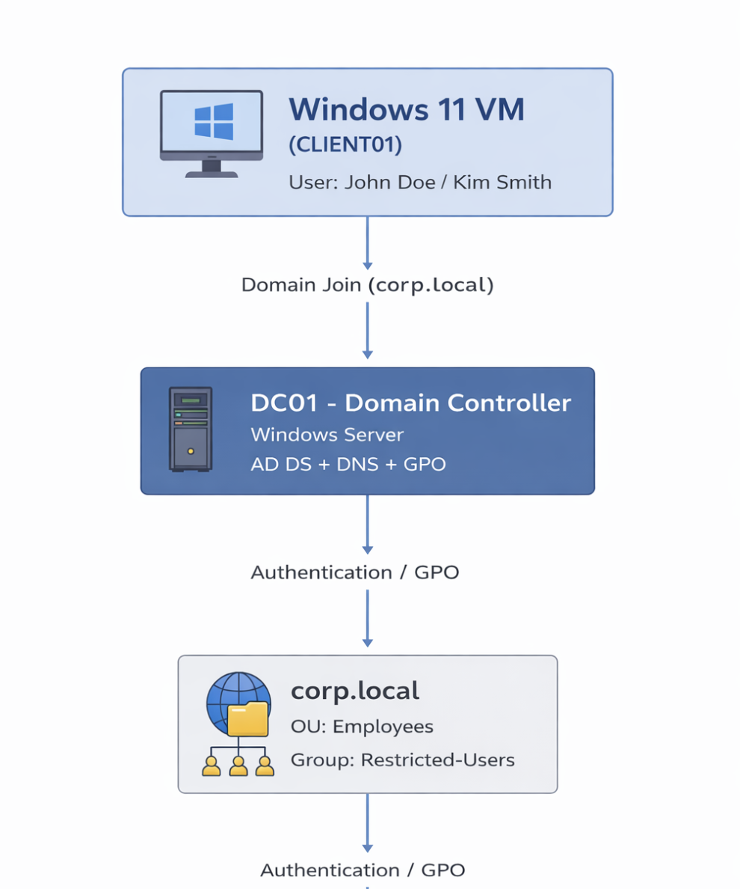

---

## 👥 Users & Groups
Created test users and applied role-based access control:

- Users:
  - John Doe (Restricted)
  - Kim Smith (Normal)
  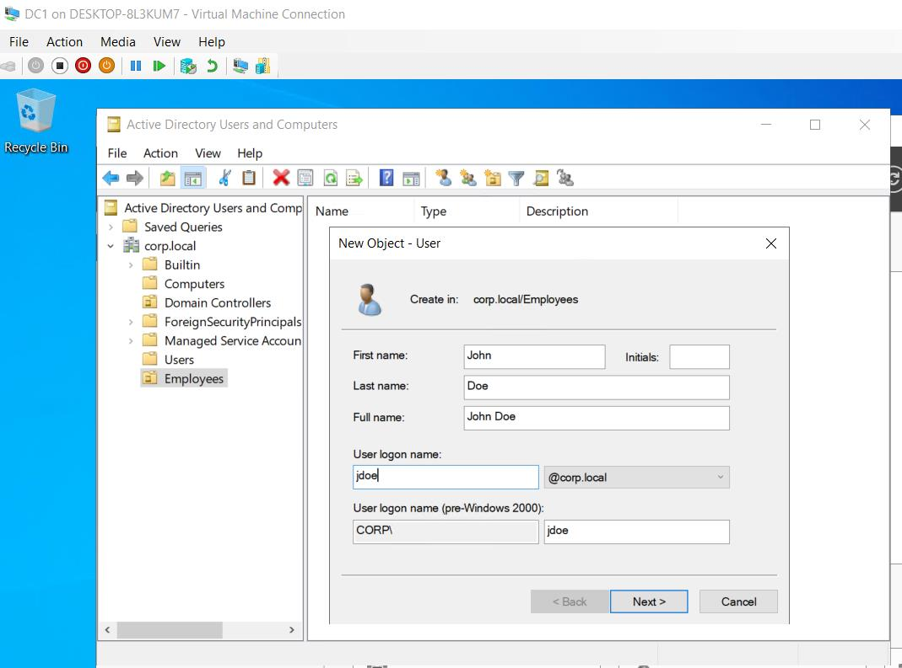
  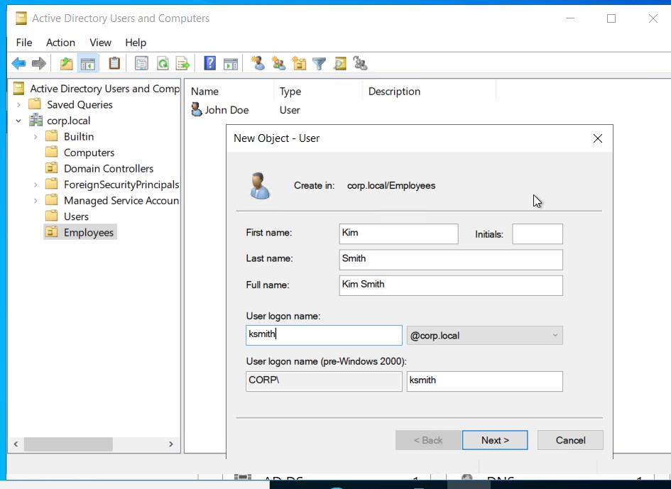

- Security Group:
  - `Restricted-Users`
  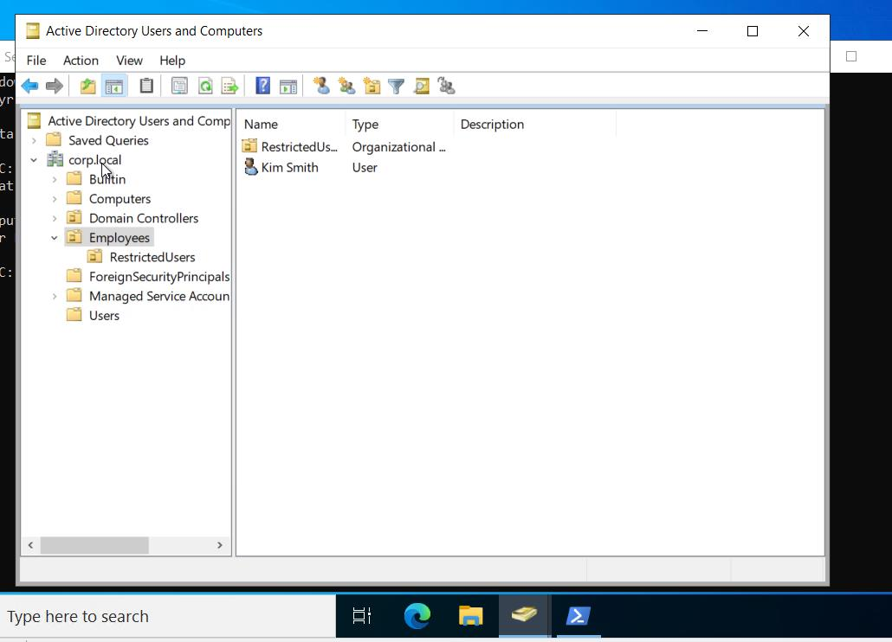

- 🧩 Password Policy
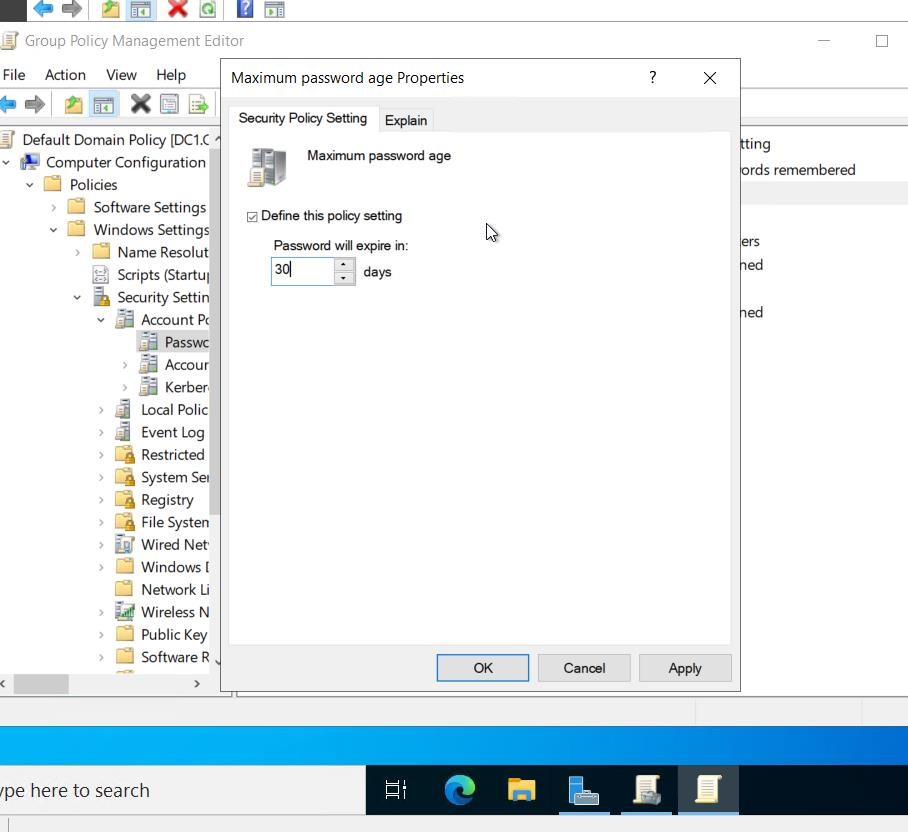
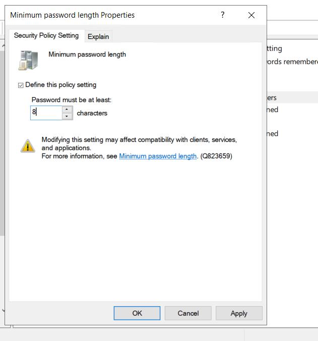

---

## ⚙️ Group Policy (GPO)
Created and applied GPO:
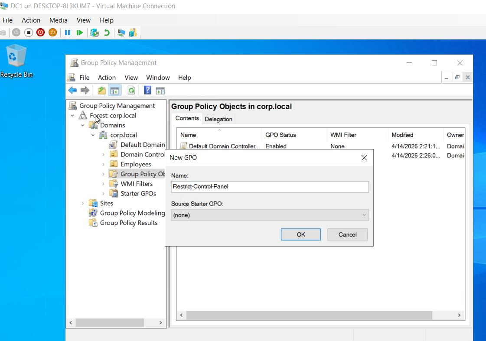

### 🎯 Policy Goal:
Restrict specific users without affecting others

### 🔒 Example Restriction:
- Disabled Control Panel access
- Restricted system features
- Disabled Command prompt for Restricted users

---

## 🧪 Testing & Validation

### ✅ Test 1 — Restricted User (John Doe)
- Policy applied successfully
- Restrictions enforced
 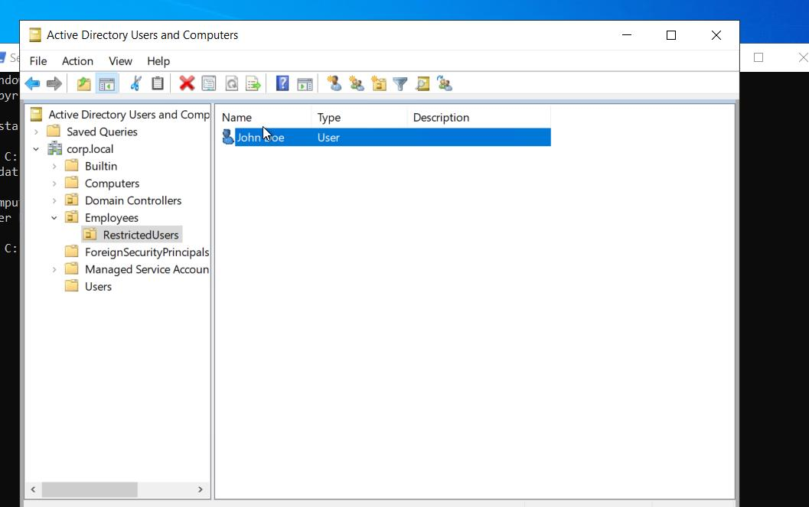
 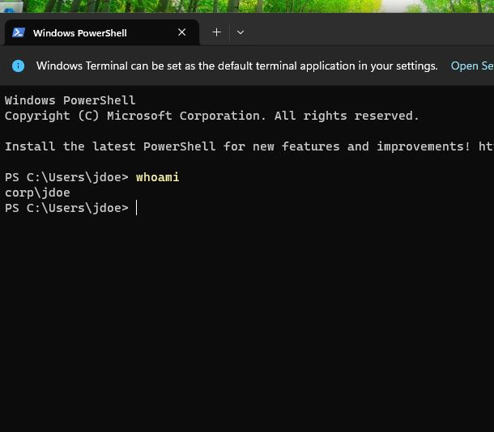
 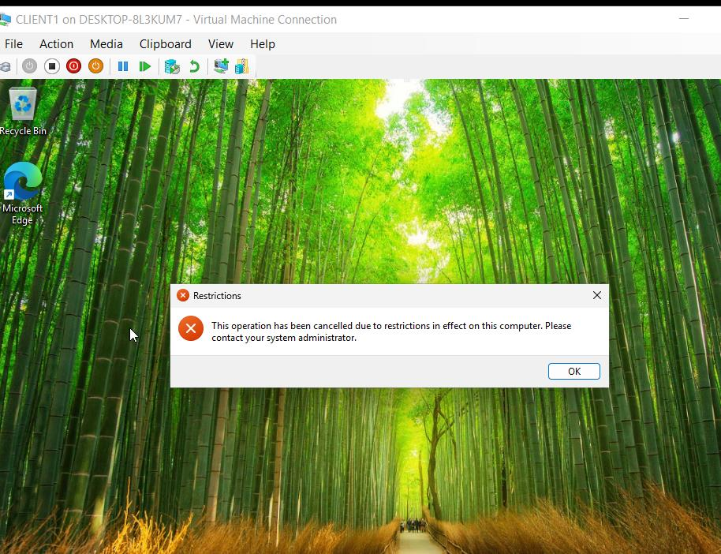
 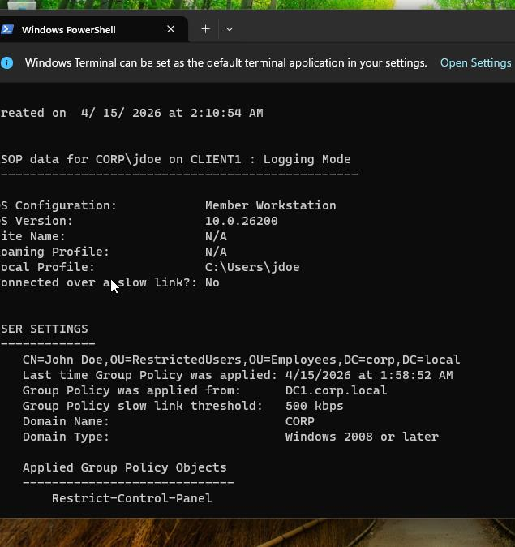

---

### ✅ Test 2 — Normal User (Kim Smith)
- No restrictions applied
- System works normally
  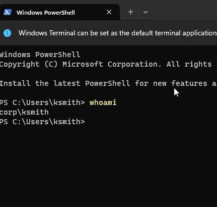
  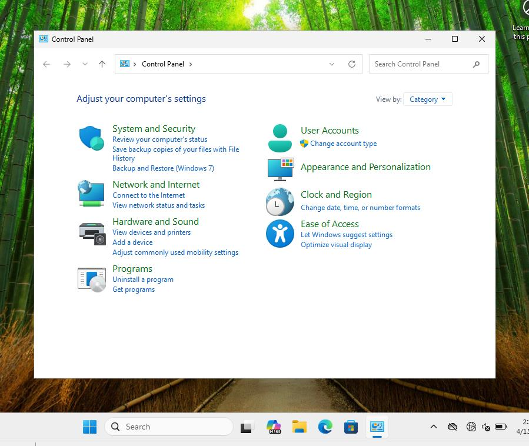

---

###✅ Test 3- Restricted User (John Doe)

---

## 🧠 Key Skills Demonstrated
- Active Directory setup & management
- Domain join & authentication
- Group Policy creation & targeting
- Security group-based access control
- Troubleshooting login and policy issues

---

## 🛠️ Troubleshooting

### Issue: Unable to log in
- Cause: Used local account instead of domain account
- Fix: Used `CORP\username`

### Issue: GPO not applying
- Fix:
  - `gpupdate /force`
  - Verified Security Filtering

---

## 🚀 Conclusion
This lab demonstrates how to manage users, enforce security policies, and troubleshoot real-world Active Directory environments.

---
