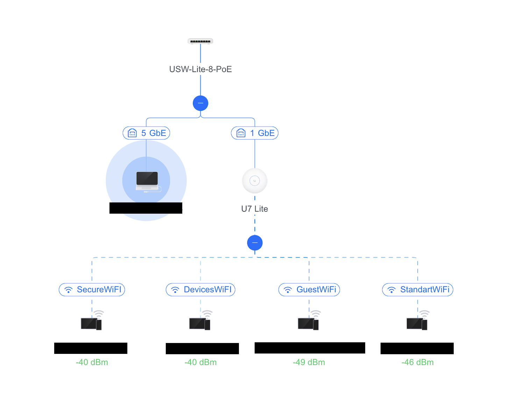

# Small Business Network Infrastructure Lab (OPNsense + UniFi)

## Overview

Designed and deployed a **small-business style segmented network** using real hardware:

- **Firewall Appliance:** Protectli VP4650 running OPNsense  
- **Managed Switch:** UniFi Lite 8 PoE  
- **Wireless Access Point:** UniFi U7 Lite  
- **Management Platform:** UniFi Network Application  

This project demonstrates practical hands-on experience with technologies and responsibilities commonly seen in real IT environments, including:

- VLAN segmentation
- Deny-by-default firewall design
- Dedicated management access
- DHCP and DNS infrastructure
- IDS / IPS monitoring with Suricata
- Managed switching and wireless VLAN mapping
- Structured troubleshooting
- Technical documentation

---

## Business Relevance

This lab was designed to simulate a small business environment where different users, guests, and devices require different trust levels, controlled access, reliable infrastructure services, and secure administration.

The design reflects practical responsibilities relevant to:

- Help Desk Technician
- IT Support Specialist
- Junior Network Administrator
- NOC Technician
- SOC Analyst (Tier 1)

---

## Network Topology

---

## Project Highlights

- Built a segmented production-style network using real hardware
- Separated management, guest, user, and restricted-device traffic
- Applied least-privilege firewall policies between trust zones
- Enforced internal DNS through Unbound
- Deployed Kea DHCP scopes per subnet
- Enabled Suricata IDS / IPS visibility
- Integrated OPNsense routing with UniFi switching and wireless infrastructure

---

# OPNsense Configuration

## 01. Dashboard

Main firewall overview showing platform health, running services, and system status.

---

## 02. Interface Assignments

Physical and logical interfaces mapped to the correct networks and VLANs.

---

## 03. Interfaces Overview (View 1)

Segmented interface layout with dedicated networks for different trust levels.

---

## 04. Interfaces Overview (View 2)

Additional view of the multi-network design and addressing layout.

---

## 05. Admin Management Rules

Dedicated management path used for secure firewall administration and recovery access.

---

## 06. Guest Access Rules

Guest devices isolated from internal resources while retaining internet access.

---

## 07. Restricted Devices Rules

Low-trust network with tighter outbound controls and blocked access to sensitive internal systems.

---

## 08. Secure Users Rules

Higher-trust network used for primary personal or administrative devices.

---

## 09. Standard Users Rules

Separate user zone for everyday devices with distinct access requirements.

---

## 10. WAN Rules

WAN-facing deny-by-default posture with no unnecessary inbound exposure.

---

## 11. Firewall Aliases

Aliases used to simplify policy management and improve rule readability.

---

## 12. Outbound NAT

Automatic outbound NAT supporting internet access across multiple internal networks.

---

## 13. LAN Rules

Firewall policies applied to the LAN / backbone side of the network design.

---

## 14. Advanced Firewall Settings

Advanced firewall behavior supporting hardened management access and custom policy design.

---

## 15. Suricata Netmap IPS Administration

Intrusion prevention configured on selected interfaces for active traffic inspection.

---

## 16. Suricata IDS Alert

Example alert demonstrating visibility into inspected traffic.

---

## 17. Kea DHCPv4 Settings

DHCP service configuration supporting segmented client addressing.

---

## 18. Kea DHCPv4 Subnets

Separate DHCP scopes assigned per VLAN/subnet.

---

## 19. Unbound DNS General

Internal DNS resolver configuration used for controlled name resolution.

---

## 20. Unbound DNS Advanced

Advanced resolver behavior and security-related DNS settings.

---

## 21. Unbound DNS Access Lists

Resolver access restricted to approved internal networks only.

---

## 22. Backup Creation

Configuration backup process used before major changes or upgrades.

---

## 23. Firmware Audit

Firmware audit and package validation workflow.

---

## 24. Administration Settings

GUI management settings supporting secure administrative behavior.

---

# UniFi Network Integration

## 01. Topology

Overview of the switch, access point, and connected infrastructure.

---

## 02. Wi-Fi Settings

Wireless configuration supporting segmented SSIDs and VLAN mapping.

---

## 03. Port Configuration

Switch port profiles used for trunking and VLAN transport.

---

## 04. Client Devices

Managed visibility into connected endpoint devices.

---

## 05. Networks and Wi-Fi

Relationship between networks, VLANs, and wireless SSIDs.

---

# Security Highlights

- Dedicated management path for firewall administration
- WAN deny-by-default posture
- Guest and restricted devices isolated from trusted networks
- Internal DNS restricted through Unbound access lists
- VLAN-based separation by trust level
- IDS / IPS inspection using Suricata
- Real hardware deployment instead of simulation-only design

---

# Troubleshooting Experience

Examples of practical issues investigated and resolved during this project:

- Apple Mail sync failures caused by blocked **IMAPS (993)**
- Apple Push / iCloud traffic requiring **5223**
- Firewall rule order affecting traffic outcomes
- GUI access planning and management recovery design
- IDS / IPS visibility validation
- DNS resolution vs connectivity troubleshooting

---

# Documentation

Additional project documentation:

- [Objectives](docs/Objectives.md)
- [Skills Demonstrated](docs/Skills-Demonstrated.md)
- [IP Addressing](docs/IP-Addressing.md)
- [VLAN Design](docs/VLAN-Design.md)
- [Troubleshooting](docs/Troubleshooting.md)
- [Key Learnings](docs/KeyLearnings.md)

---

# Summary

This project documents the design and deployment of a segmented small-business style network using **OPNsense**, **UniFi switching**, and **UniFi wireless infrastructure** on real hardware. It demonstrates practical experience in firewall administration, network segmentation, infrastructure services, wireless integration, monitoring, and structured troubleshooting.